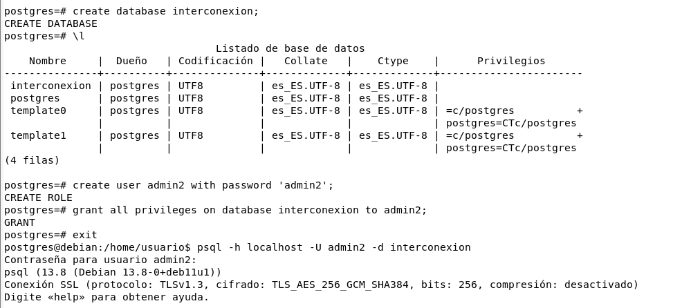
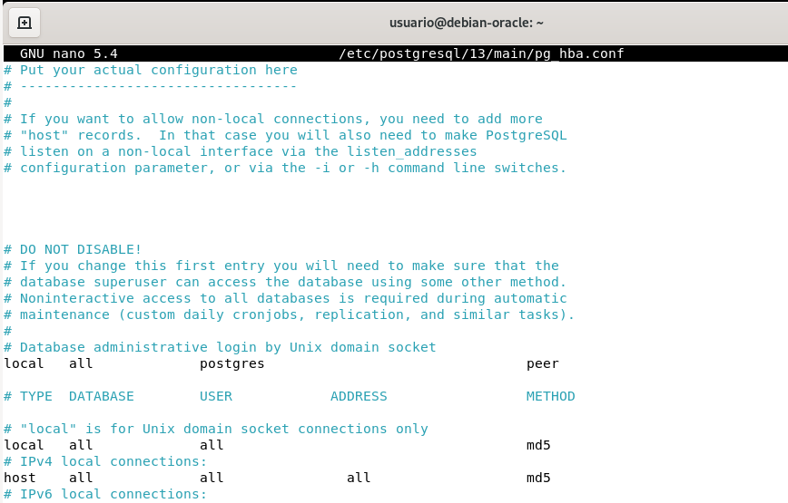
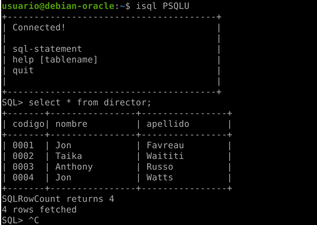

## 1. Interconexión entre dos bases de datos PostgreSQL.

### 1.1 Creación de la base de datos y usuario

Voy a usar el servidor de base de datos PostgreSQL creado en la primera [práctica](https://www.servidoresclientes.ga/ri/alumno3/#3-oracle), que tiene la base de datos *"maravilla"* con el usuario *"admin"*. Esta base de datos se encuentra en una máquina llamada **debian-oracle** con IP **192.168.122.98**.

Voy a crear otra base de datos PostgreSQL en otra máquina llamada **debian** con IP **192.168.122.156**. 

Tras instalar Postgresql sigo los siguientes pasos:

1. Entro con el usuario *postgres* a **psql** y creo una base de datos llamada ***interconexion***. 

```
create database interconexion;
```
*Podemos ver si se ha creado la base de datos con **\l**.

2. Creamos un usuario llamado admin2.

```
create user admin2 with password 'admin2';
grant all privileges on database interconexion to admin2;
```

3. Salimos y hacemos un intento de conexión con el usuario creado a la base de datos *interconexion* para comprobar que funciona.
```
exit
psql -h localhost -U admin2 -d interconexion
```

En la siguiente captura podemos ver los pasos seguidos anteriormente.



4. Creamos una tabla y añadimos algunos datos.
```
create table director
(
    codigo varchar (5),
    nombre varchar (15),
    apellido varchar (15),
    constraint pk_director primary key (codigo)
);

insert into director values ('0001','Jon', 'Favreau');
insert into director values ('0002', 'Taika', 'Waititi');
insert into director values ('0003','Anthony', 'Russo');
insert into director values ('0004','Jon', 'Watts');
```


### 1.2 Configuración básica

Modificamos el fichero /etc/postgresql/13/main/postgresql.conf, y modificamos **listen_addresses**.
```
sudo nano /etc/postgresql/13/main/postgresql.conf

listen_addresses = '*'
```


Modificamos el fichero /etc/postgresql/13/main/pg_hba.conf, y lo dejamos del siguiente modo.

```
sudo nano /etc/postgresql/13/main/pg_hba.conf

host    all     all     all     md5
```


Reiniciamos el servicio para que carguen los nuevos cambios:

```
sudo systemctl restart postgresql
```

Esta configuración también la he hecho en el otro servidor de base de datos (adjunto capturas).





### 1.3 Configuración del enlace

El enlace **dblink** lo realizamos en el servidor desde el cual queremos realizar las consultas, que en mi caso será la máquina **debian**. 

Con el usuario **postgres** entramos en la base de datos ***interconexion*** y creamos la conexión. 

```
sudo su postgres

psql -d interconexion

create extension dblink;
```

Podemos usar **\dx** para ver la lista de extensiones.


Para conectarnos desde la máquina **debian-oracle** y poder hacer consultas a la base de datos *interconexion* de la máquina **debian** tendremos que realizar estos mismos pasos.


### 1.4 Comprobación de la interconexión

**Desde el servidor PostgrSQL de la máquina debian:**

Ya podremos realizar consultas de ambas bases de datos desde la máquina **debian**. Comprobamos que podemos consultar registros de la base de datos *maravilla* usando **dblink**.

```
select * from dblink ('dbname=maravilla host=192.168.122.98 user=admin password=admin', 'select codigo,titulo from pelicula') as peliculas (codigo varchar, titulo varchar);
```


Hacemos una consulta de ambas bases de datos. La consulta mostrará el nombre y apellido de los directores que también sean actores. 

```
select director.nombre as nombre, director.apellido as apellido from director, dblink ('dbname=maravilla host=192.168.122.98 user=admin password=admin', 'select nombre, apellido from actor') as actor (nombre varchar, apellido varchar) where director.nombre=actor.nombre and director.apellido=actor.apellido;
```


**Desde el servidor PostgreSQL de la máquina debian-oracle:**

Haremos una consulta sencilla simplemente para comprobar que funciona. La consulta será la siguiente:

```
select * from dblink ('dbname=interconexion host=192.168.122.156 user=admin2 password=admin2', 'select * from director') as director (codigo varchar, nombre varchar, apellido varchar);
```


---------------------------------------
-------------------------------------
--------------------------------------


## 2. Interconexión entre dos bases de datos Oracle.

### 2.1 Configuración inicial

El primer servidor Oracle 19c será el de la máquina **debian-oracle** de la práctica anterior con la IP **192.168.122.98**. Este Oracle ya lo tenemos instalado con las tablas *pelicula*, *actor* y *pelicula_actor*, y solo tendremos que hacer algunos pequeños cambios en tnsnames.ora para que se conecte con nuestro otro servidor.

El segundo servidor Oracle también lo he instalado en Debian 11, siguiendo los mismos pasos que en la primera [práctica](https://www.servidoresclientes.ga/ri/alumno3/#3-oracle). El nombre de la máquina es **debora** y tiene la IP **192.168.122.137**.

Una vez instalado y ya habiendo a *sqlplus*, he creado un usuario llamado "usuario" con contraseña "usuario", y me he conectado con éste.
```
rlwrap sqlplus / as sysdba

create user usuario identified by usuario;

grant all privileges to usuario;

conn usuario;
```

Creo la siguiente tabla con los siguientes datos:
```
create table director
(
    codigo varchar2 (5),
    nombre varchar2 (15),
    apellido varchar2 (15),
    constraint pk_director primary key (codigo)
);

insert into director values ('0001','Jon', 'Favreau');
insert into director values ('0002', 'Taika', 'Waititi');
insert into director values ('0003','Anthony', 'Russo');
insert into director values ('0004','Jon', 'Watts');
```

### 2.2 Interconexión

Modificamos el fichero **listener.ora** para que escuche en todas las interfaces de la máquina y en el puerto por defecto 1521. Quedaría de la siguiente manera:
```
sudo nano /opt/oracle/product/19c/dbhome_1/network/admin/listener.ora 

SID_LIST_LISTENER =
  (SID_LIST =
    (SID_DESC =
      (GLOBAL_DBNAME = ORCLCDB)
      (ORACLE_HOME = /opt/oracle/product/19c/dbhome_1)
      (SID_NAME = ORCLCDB)
    )
  )

LISTENER =
  (DESCRIPTION_LIST =
    (DESCRIPTION =
      (ADDRESS = (PROTOCOL = TCP)(HOST = 0.0.0.0)(PORT = 1521))
      (ADDRESS = (PROTOCOL = IPC)(KEY = EXTPROC1521))
    )
  )
```

A continuación modificamos el fichero **tnsnames.ora**. Se creará un alias para el servidor al que nos queremos conectar (el alias que yo le he dado es DEBIAN-ORACLE). Se especifica el protocolo, la dirección IP y el puerto del servidor. En mi caso quedaría así:
```
sudo nano /opt/oracle/product/19c/dbhome_1/network/admin/tnsnames.ora


ORCLCDB =
  (DESCRIPTION =
    (ADDRESS = (PROTOCOL = TCP)(HOST = localhost)(PORT = 1521))
    (CONNECT_DATA =
      (SERVER = DEDICATED)
      (SERVICE_NAME = ORCLCDB)
    )
  )

LISTENER_ORCLCDB =
  (ADDRESS = (PROTOCOL = TCP)(HOST = localhost)(PORT = 1521))

DEBIAN-ORACLE =
  (DESCRIPTION =
    (ADDRESS = (PROTOCOL = TCP)(HOST = 192.168.122.98)(PORT = 1521))
    (CONNECT_DATA =
      (SERVER = DEDICATED)
      (SERVICE_NAME = ORCLCDB)
    )
  )
```

En el servidor de la máquina **debian-oracle** he añadido a tnsnames lo siguiente:
```
DEBORA =
  (DESCRIPTION =
    (ADDRESS = (PROTOCOL = TCP)(HOST = 192.168.122.137)(PORT = 1521))
    (CONNECT_DATA =
      (SERVER = DEDICATED)
      (SERVICE_NAME = ORCLCDB)
    )
  )
```

Después de estos cambios tenemos que asegurarnos de que el listener está activo en ambos servidores para ello, con el usuario *oracle* comprobamos el estado, y si no está en funcionamiento lo activamos.
```
su oracle

lsnrctl status

lsnrctl start
```


Ya podemos crear la conexión.

```
create database link debianoracle_link connect to admin identified by admin using 'debian-oracle';
```

* **debianoracle_link:** es el nombre que le he dado a la conexión.
* conect to **admin**: es el usuario del servidor debian-oracle.
* identified by **admin**: es la contraseña del usuario.
* using **debian-oracle**: es el nombre del alias que he creado en tnsnames.ora


### 2.3 Prueba de conexión

###### Desde la máquina debora:

Hacemos algunas consultas para comprobar que funciona.

```
select * from pelicula@debianoracle_link;

select director.nombre as nombre, director.apellido as apellido from actor@debianoracle_link actor, director where director.nombre=actor.nombre and director.apellido=actor.apellido;
```


###### Desde la máquina debian-oracle:

Creamos el enlace:

```
create database link debora_link connect to usuario identified by usuario using 'debora';
```

Hacemos una consulta sencilla para comprobar que funciona. 

```
select * from director@debora_link;
```


--------------------------------------
-------------------------------------
---------------------------------------


## 3. Interconexión entre base de dato Oracle y Postgres (usando Heterogeneus Services).

Para este último apartado, voy a conectar el servidor de base de datos PostgreSQL de la máquina **debian** del primer apartado (IP **192.168.122.156**) con la base de datos Oracle 19c de la máquina **debian-oracle** (IP **192.168.122.98**).

En el servidor PostgreSQL tengo creada la base de datos *interconexion* con la tabla *director* y el usuario *admin2*.

En el servidor Oracle tengo creadas las tablas *pelicula*, *actor* y *pelicula_actor*. Y el usuario es *admin*.

Dependiendo del servidor desde el que realicemos la conexión se hará de una forma u otra.

### 3.1 Conexión desde Oracle 19c a PostgreSQL:

#### 3.1.1 Instalar y configurar el driver ODBC:

Instalamos el driver **ODBC** en el servidor **debian-oracle**. Este nos permitirá acceder a cualquier sistema gestor de base de datos.

```
sudo apt install odbc-postgresql unixodbc
```

Se nos crea el fichero **/etc/odbcinst.ini** automáticamente. En este nos aparecerá la siguiente información (la dejamos tal cual).

```
[PostgreSQL ANSI]
Description=PostgreSQL ODBC driver (ANSI version)
Driver=psqlodbca.so
Setup=libodbcpsqlS.so
Debug=0
CommLog=1
UsageCount=1

[PostgreSQL Unicode]
Description=PostgreSQL ODBC driver (Unicode version)
Driver=psqlodbcw.so
Setup=libodbcpsqlS.so
Debug=0
CommLog=1
UsageCount=1
```

A continuación añadimos la información de la conexión al fichero **/etc/odbc.ini**, el cual por defecto se encuentra vacío. Añadimos lo siguiente:

```
[PSQLA]

Debug = 0
CommLog = 0
ReadOnly = 1
Driver = PostgreSQL ANSI
Servername = 192.168.122.156
Username = admin2
Password = admin2
Port = 5432
Database = interconexion
Trace = 0
TraceFile = /tmp/sql.log

[PSQLU]

Debug = 0
CommLog = 0
ReadOnly = 0
Driver = PostgreSQL Unicode
Servername = 192.168.122.156
Username = admin2
Password = admin2
Port = 5432
Database = interconexion
Trace = 0
TraceFile = /tmp/sql.log

[Default]
Driver = /usr/lib/x86_64-linux-gnu/odbc/liboplodbcS.so
```

Con **isql** podemos comprobar que ya tenemos conexión a la base de datos y ver sus tablas. 




#### 3.1.2 Configurar Heterogeneus Services en Oracle:

Aunque podamos ver datos con el driver, Oracle todavía no está configurado para usarlo, así que esto será lo siguiente que haremos.

Añadimos al fichero de inicio para Heterogeneus la siguiente información. El fichero se encuentra en **/opt/oracle/product/19c/dbhome_1/hs/admin/initPSQLU.ora**.

```
sudo nano /opt/oracle/product/19c/dbhome_1/hs/admin/initPSQLU.ora. 

HS_FDS_CONNECT_INFO = PSQLU
HS_FDS_TRACE_LEVEL = DEBUG
HS_FDS_SHAREABLE_NAME = /usr/lib/x86_64-linux-gnu/odbc/psqlodbcw.so
HS_LANGUAGE = AMERICAN_AMERICA.WE8ISO8859P1
set ODBCINI=/etc/odbc.ini
```

* HS_FDS_CONNECT_INFO: indicamos un nombre al servicio.

* HS_FDS_TRACE_LEVEL: para activar el servicio.

* HS_FDS_SHAREABLE_NAME: el directorio concreto del driver configurado anteriormente.

* HS_LANGUAGE: el idioma por defecto.

* set ODBCINI: el fichero de configuración del driver para PSQL.


Ahora configuramos **listener.ora** para especificar el driver que queremos que use al escuchar las peticiones.

```
sudo nano /opt/oracle/product/19c/dbhome_1/network/admin/listener.ora
```

Añadimos otra entrada a SID_LIST.
```
(SID_DESC=
         (SID_NAME=PSQLU)
         (ORACLE_HOME=/opt/oracle/product/19c/dbhome_1)
         (PROGRAM=dg4odbc)
)
```

**listener.ora** quedaría de la siguiente forma:
```
SID_LIST_LISTENER =
  (SID_LIST =
    (SID_DESC =
      (GLOBAL_DBNAME = ORCLCDB)
      (ORACLE_HOME = /opt/oracle/product/19c/dbhome_1)
      (SID_NAME = ORCLCDB)
    )
    (SID_DESC =
         (SID_NAME = PSQLU)
         (ORACLE_HOME = /opt/oracle/product/19c/dbhome_1)
         (PROGRAM = dg4odbc)
    )
  )

LISTENER =
  (DESCRIPTION_LIST =
    (DESCRIPTION =
      (ADDRESS = (PROTOCOL = TCP)(HOST = 0.0.0.0)(PORT = 1521))
      (ADDRESS = (PROTOCOL = IPC)(KEY = EXTPROC1521))
    )
  )
```

También incluimos una entrada en el fichero **tnsnames.ora**.
```
sudo nano /opt/oracle/product/19c/dbhome_1/network/admin/tnsnames.ora

PSQLU =
    (DESCRIPTION =
        (ADDRESS = (PROTOCOL=tcp) (HOST = localhost) (PORT = 1521))
        (CONNECT_DATA = (SID = PSQLU))
        (HS = OK)
    )
```

**tnsnames.ora** quedaría del siguiente modo:
```
ORCLCDB =
  (DESCRIPTION =
    (ADDRESS = (PROTOCOL = TCP)(HOST = debian-oracle)(PORT = 1521))
    (CONNECT_DATA =
      (SERVICE_NAME = ORCLCDB)
    )
  )

LISTENER_ORCLCDB =
  (ADDRESS = (PROTOCOL = TCP)(HOST = debian-oracle)(PORT = 1521))

PSQLU =
    (DESCRIPTION =
        (ADDRESS = (PROTOCOL = tcp)(HOST = localhost)(PORT = 1521))
        (CONNECT_DATA = (SID = PSQLU))
        (HS = OK)
    )
```

Por último, reiniciamos el listener desde el usuario *oracle*.

```
su oracle

lsnrctl stop
lsnrctl start
```

#### 3.1.3 Prueba de conexión

Entramos en sqlplus y creamos el enlace.
```
rlwrap sqlplus admin

create public database link linkpostgres connect to "admin2" identified by "admin2" using 'PSQLU';
```


Hacemos un par de consultas para comprobar que funciona.

```
select "nombre" from "director"@linkpostgres;

select director."nombre" as nombre, director."apellido" as apellido from actor, "director"@linkpostgres director where director."nombre" = actor.nombre and director."apellido" = actor.apellido;
```


### 3.2 Conexión desde PstgreSQL a Oracle 19c:

En la máquina **debian** con el servidor PostgreSQL, lo primero que habrá que hacer es instalar los siguientes paquetes si no los tenemos.

```
sudo apt install alien libaio1 postgresql-server-dev-all build-essential git
```

Descargamos los .rpm de Oracle Instant Client, que usaremos para poder conectarnos a la base de datos Oracle.

```
wget https://download.oracle.com/otn_software/linux/instantclient/195000/oracle-instantclient19.5-basic-19.5.0.0.0-1.x86_64.rpm
wget https://download.oracle.com/otn_software/linux/instantclient/195000/oracle-instantclient19.5-sqlplus-19.5.0.0.0-1.x86_64.rpm
wget https://download.oracle.com/otn_software/linux/instantclient/195000/oracle-instantclient19.5-tools-19.5.0.0.0-1.x86_64.rpm
wget https://download.oracle.com/otn_software/linux/instantclient/195000/oracle-instantclient19.5-devel-19.5.0.0.0-1.x86_64.rpm
```

Convertimos los .rpm a .deb con alien.

```
sudo alien -d oracle-instantclient19.5-basic-19.5.0.0.0-1.x86_64.rpm
sudo alien -d oracle-instantclient19.5-sqlplus-19.5.0.0.0-1.x86_64.rpm
sudo alien -d oracle-instantclient19.5-tools-19.5.0.0.0-1.x86_64.rpm
sudo alien -d oracle-instantclient19.5-devel-19.5.0.0.0-1.x86_64.rpm
```

Instalamos los .deb.

```
sudo dpkg -i oracle-instantclient19.5-basic_19.5.0.0.0-2_amd64.deb
sudo dpkg -i oracle-instantclient19.5-sqlplus_19.5.0.0.0-1.x86_64.deb
sudo dpkg -i oracle-instantclient19.5-tools_19.5.0.0.0-1.x86_64.deb
sudo dpkg -i oracle-instantclient19.5-devel_19.5.0.0.0-1.x86_64.deb
```

El paquete **oracle_fdw** para PostgreSQL la he clonado de este repositorio git.
```
git clone https://github.com/laurenz/oracle_fdw.git
```

A continuación he añadido las siguientes variables de entorno a **~/.bashrc**
```
sudo nano ~/.bashrc

export ORACLE_HOME="/usr/lib/oracle/19.5/client64"
export LD_LIBRARY_PATH="/usr/lib/oracle/19.5/client64/lib"
export PATH=$ORACLE_HOME:$PATH
export USE_PGXS=1
```

Compilamos el paquete con **make**.
```
cd oracle_fdw
make
```

Para que la instalación no de error hay que modificar el fichero **Makefile** añadiendo las siguientes líneas:

* `-I/usr/include/oracle/19.5/client64` : Se añade en la variable **PG_CPPFLAGS**
* `-L/usr/lib/oracle/19.5/client64/lib` : Se añade en la variable **SHLIB_LINK**

Realizamos la instalación.
```
sudo make install
```

Entramos en la base de datos con el usuario *postgres* y creamos la extensión, como se ve a continuación.
```
su postgres
psql

create extension oracle_fdw;
```

Ahora se creará un servidor con ***create server*** en el que se especificará un nombre para la conexion, el nombre de la extension **oracle_fdw**, la IP del servidor Oracle 19c y el nombre de la base de datos.
```
create server linkoracle foreign data wrapper oracle_fdw options(dbserver '//192.168.122.98:1521/ORCLCDB');
```

Le asignamos a esta conexión el nombre de usuario y contraseña.
```
create user mapping for postgres server linkoracle options(user 'admin',password 'admin');
```

Por último se crea una tabla externa con las mismas columnas de la tabla original. En mi caso crearé una tabla externa de la tabla *película*. Las opciones **schema** y **table** deben ir en mayúsculas. Quedaría de la siguiente forma:
```
create foreign table pelicula(codigo varchar(5),titulo varchar(30),fecha_estreno date, puntuacion numeric(3,1),lengua_original varchar(3)) server linkoracle options(schema 'ADMIN', table 'PELICULA');
```

Ya podremos realizar la consulta desde PostgreSQL al servidor Oracle.

```
select * from pelicula;
```

