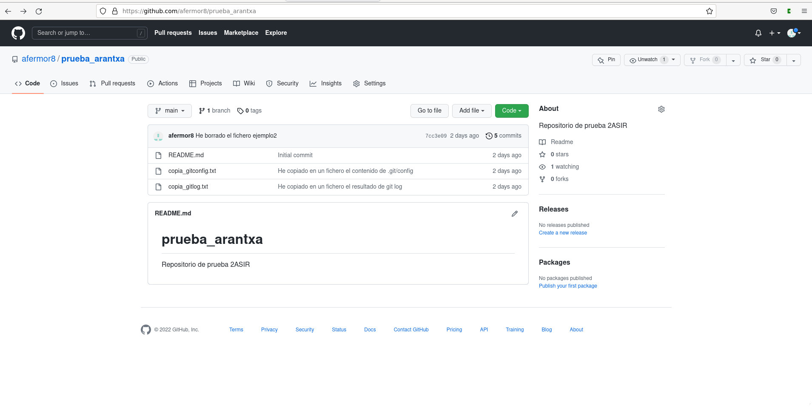

## Introducción a Git y Github

1. Una captura de pantalla donde se vea que has creado el repositorio.



2. El contenido del fichero .git/config para que se vea que has clonado el repositorio con la URL ssh.
Contenido del fichero .git/config:

```
[core]
    repositoryformatversion = 0
    filemode = true
    bare = false
    logallrefupdates = true
[remote origin]
    url = git@github.com:afermor8/prueba_arantxa.git
    fetch = +refs/heads/*:refs/remotes/origin/*
[branch main]
    remote = origin
    merge = refs/heads/main
```


3. La salida de la instrucción git log para ver los commits que has realizado (debe aparecer como autor tu nombre completo).

Resultado de git log:

```
commit babc5521d12d807bac2fdf3a45f7157420fbebb9 (HEAD -> main, origin/main, origin/HEAD)
Author: Afermor8 <ara.fer.mor@gmail.com>
Date:   Mon Sep 19 14:23:47 2022 +0200

    He copiado en un fichero el contenido de .git/config

commit 7cc3e091cb2c047fa01716877957ba059cc83a9d
Author: Afermor8 <ara.fer.mor@gmail.com>
Date:   Mon Sep 19 12:00:51 2022 +0200

    He borrado el fichero ejemplo2

commit 5d3058e528b241d0425dfa74be573805a809be52
Author: Afermor8 <ara.fer.mor@gmail.com>
Date:   Mon Sep 19 11:59:58 2022 +0200

    He cambiado el nombre del fichero

commit d2da5597f68fc32763647e03e3b5b97de7d0c19d
Author: Afermor8 <ara.fer.mor@gmail.com>
Date:   Mon Sep 19 10:35:46 2022 +0200

    He modificado el fichero ejemplo.txt

commit 8464596cf44b2a5c27858d6adb65763ac047e51e
Author: Afermor8 <ara.fer.mor@gmail.com>
Date:   Mon Sep 19 10:33:50 2022 +0200

    He creado el fichero ejemplo.txt

commit a39a8b71c953f9a07c714e7f0a18e16044d460d2
Author: afermor8 <99648477+afermor8@users.noreply.github.com>
Date:   Mon Sep 19 10:08:52 2022 +0200

    Initial commit
```


4. Buscar información para crear un nuevo repositorio llamado prueba2_tu_nombre. En esta ocasión, crea primero el repositorio local (usando git init) y luego busca información para sincronizarlo y crear el repositorio remoto en GitHub. Comenta los pasos que has realizado y manda alguna prueba de funcionamiento.
Así he creado el repositorio local:

```
arantxa@debian:~$ git init prueba2_arantxa
ayuda: Using 'master' as the name for the initial branch. This default branch name
ayuda: is subject to change. To configure the initial branch name to use in all
ayuda: of your new repositories, which will suppress this warning, call:
ayuda:
ayuda:     git config --global init.defaultBranch <name>
ayuda:
ayuda: Names commonly chosen instead of 'master' are 'main', 'trunk' and
ayuda: 'development'. The just-created branch can be renamed via this command:
ayuda:
ayuda:     git branch -m <name>
Inicializado repositorio Git vacío en /home/arantxa/prueba2_arantxa/.git/

arantxa@debian:~$ cd prueba2_arantxa/

arantxa@debian:~/prueba2_arantxa$ nano creacion.txt

arantxa@debian:~/prueba2_arantxa$ git add .

arantxa@debian:~/prueba2_arantxa$ git commit -m "He creado un archivo con el proceso de creacion"
[master (commit-raíz) ee32a6f] He creado un archivo con el proceso de creacion
 1 file changed, 1 insertion(+)
 create mode 100644 creacion.txt
```

Creo un repositorio en Github con el mismo nombre y hago los siguientes pasos:
```
arantxa@debian:~/prueba2_arantxa$ git branch -M main

arantxa@debian:~/prueba2_arantxa$ git remote add origin git@github.com:afermor8/prueba2_arantxa.git

arantxa@debian:~/prueba2_arantxa$ git push -u origin main
Enumerando objetos: 3, listo.
Contando objetos: 100% (3/3), listo.
Escribiendo objetos: 100% (3/3), 272 bytes | 272.00 KiB/s, listo.
Total 3 (delta 0), reusado 0 (delta 0), pack-reusado 0
To github.com:afermor8/prueba2_arantxa.git
 * [new branch]      main -> main
Rama 'main' configurada para hacer seguimiento a la rama remota 'main' de 'origin'.
```
Y ya estaría creado en Github sincronizado con el repositorio local.
